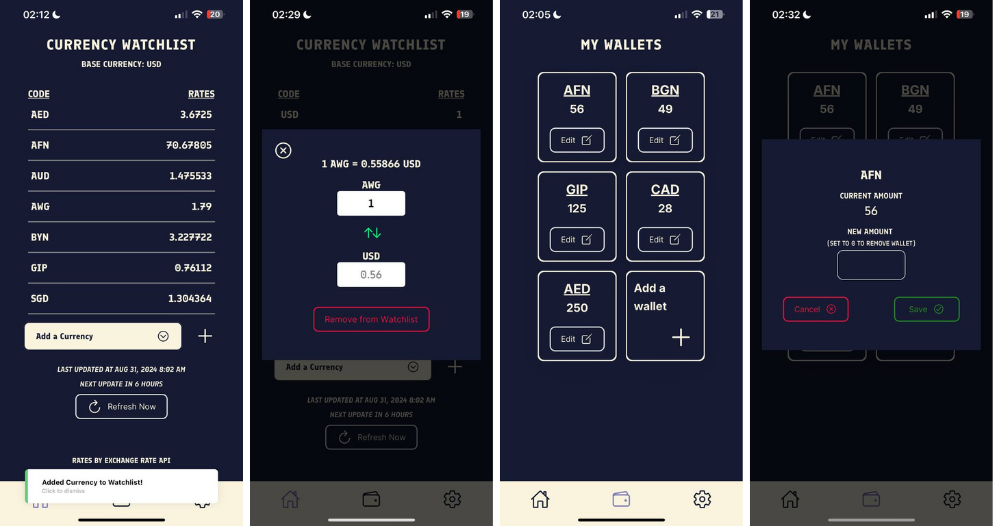
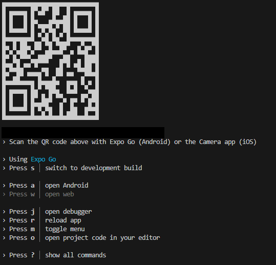

# Currency Master - A Foreign Exchange Rate Mobile Application



## Application Features
1. Exchange Rate data: Data of over 161 currencies, updated daily from Exchange-Rate API.

2. Currencies Watchlist: Users can add currencies to their watchlist.

3. Currency conversion: Users can convert currencies between their selected base currency and a currency in their watchlist.

4. Wallets: Allows users to record and track their foreign assets in wallets.

5. Cloud backup: User data like wallets, watchlisted currencies, and preferred base currency are backed up on Google Firebase and persists between sessions and devices.

## Application Preview (Expo Go Application required)
The Expo Go Application can be downloaded from think link: https://expo.dev/go.

There is an EAS preview build setup for this project which can be found here:

(IOS & Android)

https://expo.dev/preview/update?message=fixed%20add%20wallet%20text&updateRuntimeVersion=1.0.0&createdAt=2024-09-08T09%3A17%3A26.765Z&slug=exp&projectId=c55dd1fc-aad5-45dc-a5d0-f663c58d75f5&group=517b7355-bd0c-4d03-91b1-390e45efca03. 

In the event where the Expo EAS Preview build is unavailable on the Expo server, there is a downloaded APK build always available at:

(Android only)

https://drive.google.com/file/d/1gTuFnRtAaZQN_lcVBMzYWoV5Hg6Doqon/view?usp=drive_link. 


## How to Run Locally
First, ensure that package-lock.json is deleted.

Next, run this command in the terminal to install dependencies packages.
```
npm install
```
After all packages are installed, bundle the application by running this command in the terminal.
```
npx expo
```
The application should be bundled and waiting.



You can launch the application on your own device using Expo Go. Read more on https://expo.dev/go.

Alternatively, you can launch the application using an emulator.


## Testing
1. Unit Testing by Jest.
To run Jest test suites, run the following code in the terminal.

```
npm run test
```

2. User Testing using Blackbox (Task-based Testing).
